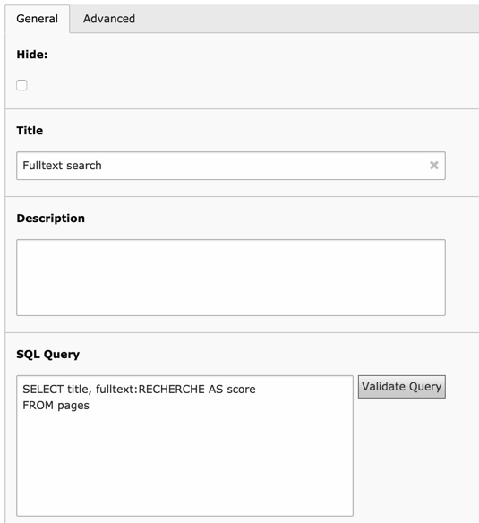

.. ==================================================
.. FOR YOUR INFORMATION
.. --------------------------------------------------
.. -*- coding: utf-8 -*- with BOM.

.. include:: ../Includes.txt

.. _introduction:

Introduction
------------

The dataquery extension is a Data Provider for the Tesseract
framework. It can be used to query the local TYPO3 database and return
the resulting recordset in a standardized data structure (SDS) of type
"recordset" or "idlist".

It is designed to make it easy to write SQL by automating the handling
of all the TYPO3 standard mechanisms, like enable fields and language
overlays.

.. _introduction-screenshot:

Screenshot
^^^^^^^^^^

Here's a view of a Data Query record in the TYPO3 BE:

	A dataquery record open for input in the TYPO3 BE

.. _introduction-questions:

Questions?
^^^^^^^^^^

If you have any questions about this extension, you may want to refer
to the Tesseract Project web site http://www.typo3-tesseract.com/
for support and tutorials. You
may also ask questions in the TYPO3 English mailing list
(typo3.english).

.. _introduction-happy-developer:

Keeping the developer happy
^^^^^^^^^^^^^^^^^^^^^^^^^^^

If you like this extension, you may Flattr it or make noise about it by
using the social bookmarks available in the extension's detailed view
on typo3.org:

http://typo3.org/extensions/repository/view/dataquery

You may also take a step back and reflect about the beauty of sharing.
Think about how much you are benefiting and how much yourself is
giving back to the community.

