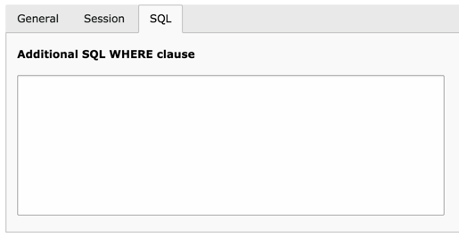

.. ==================================================
.. FOR YOUR INFORMATION
.. --------------------------------------------------
.. -*- coding: utf-8 -*- with BOM.

.. include:: ../../Includes.txt

.. _queries-additional-sql:

Additional SQL in Data Filter
^^^^^^^^^^^^^^^^^^^^^^^^^^^^^

Data Query adds an "additional SQL" field to the Data Filters. This
makes it possible to directly add some SQL which will be added to the
WHERE part of the query. This field can be used for SQL-specific
conditions which cannot be expressed with standard Data Filter syntax.

	The "Additional SQL" in the datafilter record

Expressions can be used in the "additional SQL" field too.

