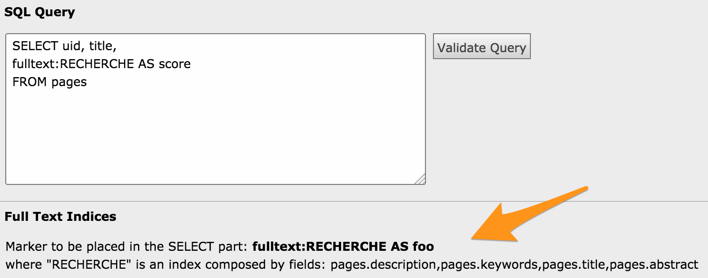

.. ==================================================
.. FOR YOUR INFORMATION
.. --------------------------------------------------
.. -*- coding: utf-8 -*- with BOM.

.. include:: ../../Includes.txt

.. _queries-fulltext:

Fulltext searches
^^^^^^^^^^^^^^^^^

Since version 1.11, Data Query supports fulltext searches. A working
fulltext query requires several components.

#. First and foremost, the tables which we want to query using
   a fulltext search must have at least one fulltext index.
   For example, the "tt_content" table could be extended to be
   searchable on header and bodytext by using the adding SQL
   statement to an extension's :file:`ext_tables.sql` file:

   .. code-block:: sql

      CREATE TABLE tt_content (
          FULLTEXT KEY SEARCH (header,bodytext)
      );

#. In a Data Query query, the fulltext search index must be used
   as part of the list of selected fields and reference with an alias.
   A special syntax is needed, using the :code:`fulltext` keyword and
   the name of the index (i.e. "SEARCH" from the example above).
   Example:

   .. code-block:: sql
      :emphasize-lines: 2

      SELECT uid, pid, header,
      fulltext:SEARCH AS score
      FROM tt_content

#. A Data Filter must be defined using either the :code:`fulltext` or
   the :code:`fulltext_natural` operator. The former will trigger a
   boolean search, the latter a natural language search. Please refer
   to the `MySQL documentation for more details <http://dev.mysql.com/doc/refman/5.6/en/fulltext-search.html>`_.

   .. note::

      Query expansion is currently not supported.

   In the Data Filter, the alias declared in the query must be used.
   In the example below, the first line will lead to a boolean search,
   the second one to a natural language search:

   .. code-block:: text

      score fulltext gp:sword
      score fulltext_natural gp_sword

   When the query is interpreted a :code:`MATCH() ... AGAINST` construct
   is used, automatically placed both in the :code:`SELECT` part and in
   the :code:`WHERE` clause.

   The alias can of course be used in the "Order by" part of the
   Data Filter, making it possible to sort the query results by
   relevance. Example:

   .. code-block:: text

      field = score
      order = desc

   This will place most relevant results first.

In the TYPO3 BE, Data Query provides some help and hints below the query field.

	Hints displayed about fulltext indices in the TYPO3 BE
