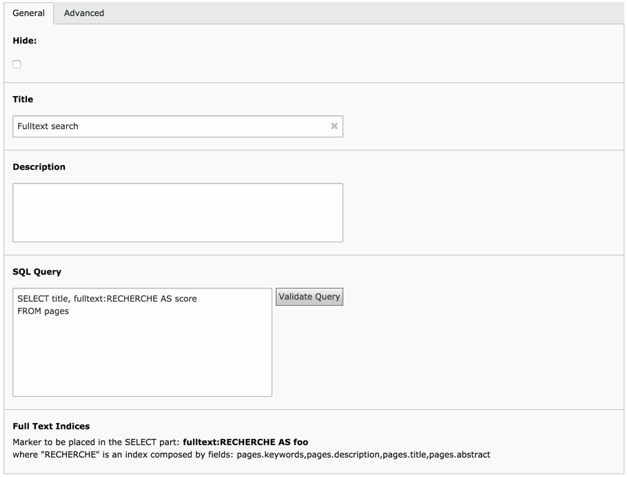
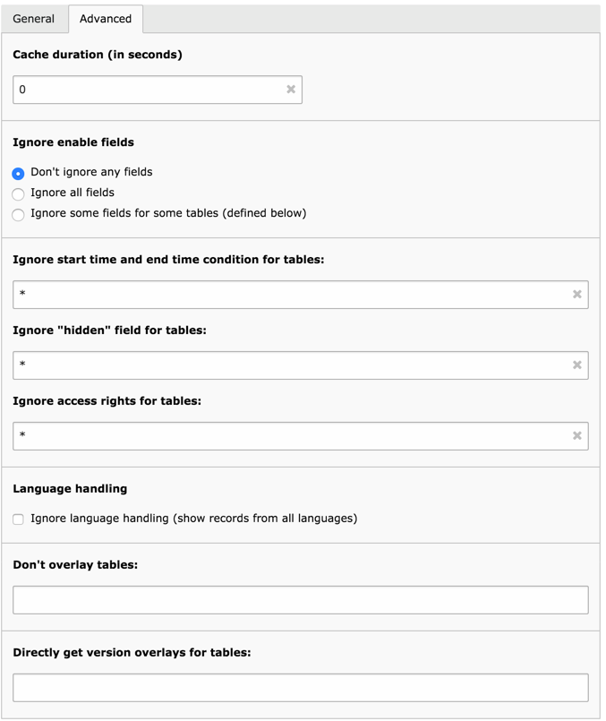

.. ==================================================
.. FOR YOUR INFORMATION
.. --------------------------------------------------
.. -*- coding: utf-8 -*- with BOM.

.. include:: ../Includes.txt

.. _user-manual:

User manual
-----------

This chapter describes how to properly create a new dataquery
record. The input is divided into two tabs, detailed below.

.. _user-manual-general:

General tab
^^^^^^^^^^^

	The "General" tab of a dataquery record

The "Hide" field is currently not actively used (i.e. the
Display Controller does not check for it). It can be used to indicate
that a given query is obsolete or should not be used.

The "Title" field is mandatory and should be a short summary of what
the query does. The "Description" field can be used for entering more
information.

The action really happens in the "SQL Query" field, where the actual query is
written. Refer to the :ref:`Writing queries chapter <queries>` for a detailed
explanation of the syntax allowed in this field (not all of the SQL
elements can be used).

Next to the "SQL query" field is a "Validate Query" button, which can
be used to verify that the query is alright. It does two checks:

- first, it parses the query and rebuilds it. The internal query parser
  may come up with errors at that point. If it doesn't a success
  message will display the resulting query.
  Note that here TYPO3 CMS mechanisms (see below) and Data Filters are not
  applied. It is only the "raw" query, as typed in the text field, that
  is parsed.

- next, the query is executed. This makes it possible to catch SQL
  errors early on. Note that a condition of "LIMIT 1" is applied to the
  query before executing it, to avoid draining server resources
  needlessly.

The "Full Text Indices" field indicates if any fulltext index
exists for the main table of the query and gives hint about how
to use it.

.. _user-manual-advanced:

Advanced tab
^^^^^^^^^^^^

	The "Advanced" tab of a dataquery record

The "Cache duration" field defines the period (in seconds) during which the
result of the query must be kept in cache. The default is 0,
meaning that the cache is disabled.
See also the :ref:`Caching chapter <behind-the-scenes-caching>`.

By default, "dataquery" transparently handles all of TYPO3 CMS's enable
fields, i.e. hidden or disabled flag, start and end time, and
fe\_groups access rights. This makes it very convenient to use, but
may be undesired in some specific situations. In such a case, it is
possible to completely disable this behavior by choosing the "Ignore
all fields" options from the "Ignore enable fields" setting.

It is also possible to make more detailed choices. When choosing the
"Ignore some fields for some tables" option, the next three text
fields can be used to precisely define which enable field should be
skipped and for which tables. Consider the following setup:

	Modified "ignore" settings in the "Advanced" tab of a dataquery record

The meaning is the following:

- the start and end time enable fields should be ignored for all tables
  (using the "\*" wildcard)

- the hidden field should be ignored for tables "tt\_content" and
  "pages" (comma-separated list of table names)

- the access rights should not be ignored for any table (field is left
  blank)

If you used aliases for table names in your SQL query, you should use
the same aliases in the ignore enable field settings.

On top of this, "dataquery" also transparently handles everything
related to language overlays. Again it is possible to disable that
behavior by checking the "Language handling" box. On a finer level,
it's possible to give a list of table for which language overlays (and
conditions) should not be applied.

Data Query also handles versioning transparently, as soon as it is
used within a workspace. This behavior cannot be switched off. However
it is sometimes necessary to influence which records are taken when
handling workspaces: the lives ones (that will be overlaid) or
directly the ones that contain the modified version. This is the point
of the "Directly get version overlays for tables" field. For any table
listed there (comma-separated list), the records will be selected
among the overlays and not the live ones. This if often necessary for
handling JOINs correctly in workspaces. If you don't use workspaces,
just ignore this option. For more details, see the
:ref:`Limitations section <behind-the-scenes-limitations>`.

See the :ref:`Behind the scene chapter <behind-the-scenes>`
for more details about what Data Query handles automatically.

.. note::

   Language and version overlays are not applied when the type
   of Data Structure returned is "idlist" (e.g. when "dataquery" is
   called as a secondary provider via the Display Controller). The
   reasoning is that the list of ids returned will always be handled by
   further processes which will take care of language and version
   overlays.
